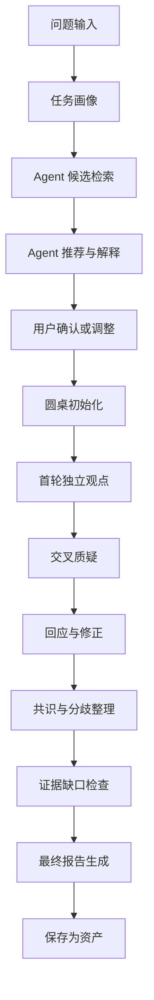

# 02. 圆桌工作流状态机

## 1. 目标

定义一次高质量圆桌从问题输入到最终报告的完整状态机，确保讨论不是自由聊天，而是有阶段、有门禁、有质疑、有修正、有证据链的结构化审议过程。

## 2. 顶层流程

## 3. 核心状态定义

### 3.1 `draft_problem`

用户正在输入问题、目标、材料和输出要求。

进入条件：

- 用户创建新任务。

必须收集：

- 原始问题。
- 目标用途。
- 期望输出形态。
- 时间约束。
- 是否允许联网。
- 是否允许读取本地材料。
- 是否保存到项目。

退出条件：

- 用户点击开始分析。

失败处理：

- 如果问题过短，系统引导补充目标和背景。
- 如果材料缺失但非必要，允许继续，并标记证据缺口。

### 3.2 `task_profile_generated`

系统完成任务画像。

任务画像必须包含：

- 任务类型。
- 行业或领域。
- 决策风险等级。
- 所需专业视角。
- 关键约束。
- 预期输出。
- 证据需求。
- 不适合参与的 Agent 类型。

退出门禁：

- 用户能看到任务画像。
- 系统能解释任务画像如何影响 Agent 推荐。

### 3.3 `agent_candidates_found`

系统从 Agent 源中找到候选 Agent。

候选来源：

- `.codex/agents/*.toml`
- `agency-agents/**/*.md`
- 基础公共 Agent。
- 用户个人 Agent，仅限当前用户可见范围。
- 已发布共享 Agent。
- 用户新增但未发布的 Agent
- 已通过验收的本地 Agent

每个候选必须有：

- Agent ID。
- Agent 名称。
- 来源。
- 版本。
- 能力标签。
- 适用边界。
- 信任状态。
- 匹配理由。
- 风险提示。

退出门禁：

- 至少找到 3 个候选。
- 如果不足 3 个，必须提示缺口并允许用户继续或新增 Agent。

### 3.4 `agent_panel_recommended`

系统生成推荐圆桌阵容。

推荐结果必须包含：

- 主席或综合器。
- 核心专家。
- 反方或质疑者。
- 证据或风控角色。
- 可选观察员。
- 若用户有个人 Agent，可参与匹配，但仍要遵守可见性、试运行状态和权限边界。

推荐解释必须包含：

- 每个 Agent 负责的问题维度。
- 为什么是它，而不是其他候选。
- 当前组合覆盖了哪些维度。
- 当前组合缺失哪些维度。
- 哪些 Agent 被排除，以及排除原因。

退出门禁：

- 用户确认阵容，或手动调整后确认。

### 3.5 `roundtable_initialized`

系统创建圆桌 Session。

必须生成：

- Session ID。
- 任务画像快照。
- Agent 版本快照。
- 材料访问策略。
- 讨论轮次计划。
- 输出格式计划。

默认轮次：

- 第 1 轮：独立观点。
- 第 2 轮：交叉质疑。
- 第 3 轮：回应修正。
- 第 4 轮：共识汇总。

MVP-0 可固定为 2 个大轮次：

- 首轮观点。
- 质疑、回应、修正、共识合并轮。

### 3.6 `independent_positions_collected`

每个核心 Agent 独立给出立场。

每个立场必须包含：

- 核心判断。
- 支撑理由。
- 关键风险。
- 需要其他 Agent 质疑的点。
- 证据需求。
- 信心等级。

退出门禁：

- 每个核心 Agent 至少提交 1 个结构化观点。
- 综合器不得提前融合观点，避免覆盖少数意见。

### 3.7 `challenges_collected`

Agent 之间完成交叉质疑。

质疑必须针对：

- 假设不成立。
- 证据不足。
- 角色视角遗漏。
- 实施成本低估。
- 风险边界不清。
- 用户体验不成立。
- 安全、隐私、合规、信任问题。

每条质疑必须绑定目标观点。

退出门禁：

- 至少产生 3 条有效质疑。
- 每个核心结论至少被一个其他 Agent 审视。
- 没有质疑的观点必须标记为“未充分挑战”。

### 3.8 `responses_and_revisions_collected`

被质疑 Agent 对质疑进行回应，并修正观点。

回应类型：

- 接受并修正。
- 部分接受。
- 反驳。
- 需要证据确认。
- 转为待确认前提。

退出门禁：

- 每条高优先级质疑都有回应。
- 被修正的观点保留修正前后差异。
- 未解决质疑进入争议地图。

### 3.9 `consensus_generated`

综合器生成共识、分歧和建议。

共识必须区分：

- 强共识：多 Agent 支持且质疑后仍成立。
- 弱共识：方向可取但证据不足。
- 明确分歧：不同 Agent 仍有冲突。
- 待验证前提：当前无法判断。

退出门禁：

- 至少输出一个可执行建议。
- 至少输出一个高风险提醒。
- 至少输出一个待确认前提。

### 3.10 `evidence_review_completed`

系统检查证据链和材料使用。

必须标记：

- 哪些结论有输入材料支撑。
- 哪些结论是 Agent 推理。
- 哪些结论需要外部核验。
- 哪些结论风险较高。
- 哪些材料被哪些 Agent 使用。

退出门禁：

- 最终报告中的关键结论都有来源类型标记。

### 3.11 `final_artifact_generated`

系统生成最终产物。

默认产物：

- Markdown 评审报告。
- 结构化 JSON 事件包。
- 争议地图。
- 证据缺口清单。
- 可复用模板草案。

退出门禁：

- 用户能查看、导出、复制或保存。
- 系统显示本次讨论是否完整完成。

### 3.12 `asset_saved`

用户主动保存本次任务资产。

可保存资产：

- 任务画像模板。
- Agent 组合模板。
- 圆桌流程模板。
- 质疑清单。
- 输出结构。
- 完整 Session。

默认策略：

- 不自动保存上传原文。
- 不自动进入全局模板库。
- 用户确认后才复用到未来推荐。

## 4. 用户介入点

用户可以在以下阶段介入：

- 任务画像生成后：修改任务目标和边界。
- Agent 推荐后：替换、增加、移除 Agent。
- 首轮观点后：补充材料或要求某 Agent 展开。
- 质疑阶段：要求更强反驳。
- 回应修正后：要求提前综合。
- 最终报告前：选择输出格式。
- 完成后：保存模板或丢弃记录。

## 5. 异常状态

### 5.1 `insufficient_agents`

没有足够 Agent 覆盖问题。

处理方式：

- 提示缺失视角。
- 推荐新增 Agent。
- 允许以较低信心继续。
- 最终报告标记“专家覆盖不足”。

### 5.2 `agent_failed`

某个 Agent 执行失败。

处理方式：

- 重试一次。
- 降级为观察员。
- 替换候选 Agent。
- 继续但标记部分失败。

### 5.3 `evidence_missing`

关键结论缺证据。

处理方式：

- 标记为待确认。
- 允许用户补充材料。
- 可触发联网核验，但必须受权限策略控制。

### 5.4 `policy_blocked`

Agent 或工具请求被权限策略阻止。

处理方式：

- 显示被阻止动作。
- 显示原因。
- 允许用户临时授权或继续不授权。
- 审计记录必须保留。

## 6. 体验要求

- 用户始终知道当前处于哪个阶段。
- 用户能区分“正在讨论”“部分失败”“已完成”“证据不足”。
- 讨论不能因为一个 Agent 失败而整体不可用。
- 系统不能把未完成质疑的结论显示为完整共识。
- 用户可以随时暂停，不丢失已完成结构化事件。

## 7. MVP-0 简化但不可删除的部分

MVP-0 可以简化：

- 固定圆桌轮次。
- 固定报告模板。
- 固定 Agent 权限。
- 本地保存，不做团队协作。
- 手动触发导出。

MVP-0 不可删除：

- 任务画像。
- Agent 推荐解释。
- 至少一轮有效质疑。
- 观点修正记录。
- 共识与分歧区分。
- 证据缺口标记。
- 结构化事件保存。
