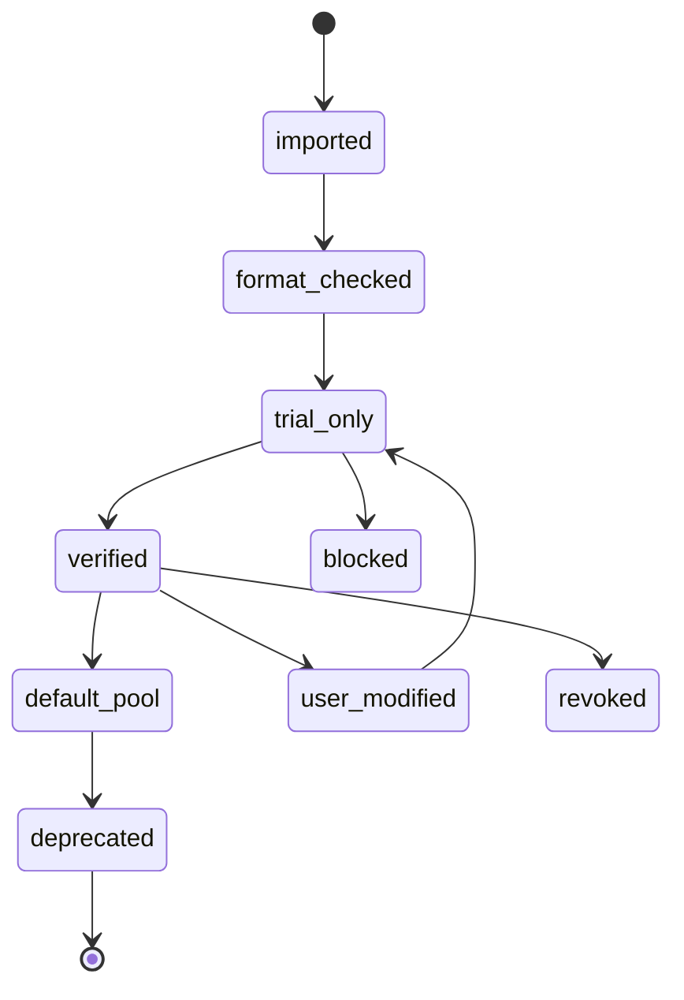

# 03. Agent 数据模型与信任模型

## 1. 目标

定义“员工”即 Agent 的数据结构、来源身份、版本身份、能力声明、验收流程、信任状态和权限边界，保证新增 Agent 不污染默认推荐池，不破坏用户材料安全，不降低圆桌质量。

## 2. 设计原则

- Agent 名称不是身份，稳定 ID 才是身份。
- Agent 当前内容不是全部历史，每次变更都必须形成版本。
- Agent 的能力不能只靠自我描述，必须经过测试或试运行。
- Agent 默认不可信，信任是逐步获得的。
- Agent 权限来自系统策略，不来自 Prompt 自律。
- Agent 被采纳的结论必须绑定 Agent 版本。
- Agent 必须明确归属、可见性和发布状态，不能只有名字没有产权。

## 3. 核心实体

### 3.1 `AgentProfile`

稳定的 Agent 身份主体。

字段：

- `agent_id`：稳定唯一 ID。
- `display_name`：显示名称，可变。
- `slug`：短名称。
- `summary`：一句话简介。
- `source_type`：来源类型。
- `source_uri`：来源路径或仓库地址。
- `created_at`：创建时间。
- `created_by`：创建者。
- `owner_user_id`：归属用户，系统公共 Agent 可为空。
- `current_version_id`：当前版本。
- `trust_status`：信任状态。
- `agent_class`：Agent 类别，包含基础公共、个人、共享。
- `visibility_scope`：可见范围。
- `publish_status`：发布状态。
- `default_pool_eligible`：是否允许进入默认推荐池。
- `published_from_agent_id`：如为共享 Agent，指向原始个人 Agent。
- `deprecated_at`：废弃时间。

### 3.2 `AgentVersion`

不可变版本记录。

字段：

- `agent_version_id`
- `agent_id`
- `version_label`
- `content_hash`
- `source_hash`
- `toml_path`
- `source_markdown_path`
- `instructions_snapshot`
- `metadata_snapshot`
- `created_at`
- `change_reason`
- `release_status`

版本规则：

- 任何 Prompt、描述、权限、能力标签、工具声明变更，都生成新版本。
- 历史圆桌继续引用旧版本。
- 删除 Agent 不删除历史版本，只改变可推荐状态。

### 3.3 `CapabilityClaim`

Agent 自称或系统解析出的能力声明。

字段：

- `claim_id`
- `agent_version_id`
- `capability_name`
- `capability_category`
- `evidence_source`
- `confidence`
- `scope`
- `limitations`

能力类别：

- 产品规划。
- 用户体验。
- UI 设计。
- 工作流架构。
- 多 Agent 系统。
- 软件架构。
- 安全架构。
- 隐私合规。
- 信任治理。
- 行业专业能力。
- 文档与交付能力。

### 3.4 `CapabilityVerification`

能力验证记录。

字段：

- `verification_id`
- `agent_version_id`
- `capability_name`
- `test_case_id`
- `test_result`
- `reviewer`
- `score`
- `failure_notes`
- `verified_at`

验证状态：

- `not_tested`
- `format_passed`
- `sample_run_passed`
- `human_review_passed`
- `production_observed`
- `failed`

### 3.5 `AgentTrustScore`

用于推荐排序和风险展示的信任摘要。

字段：

- `agent_id`
- `agent_version_id`
- `source_trust`
- `format_quality`
- `capability_verified_count`
- `recent_success_rate`
- `policy_risk`
- `privacy_risk`
- `recommendation_weight`

注意：

- 信任分不是绝对质量分。
- 信任分只影响推荐权重和风险提示，不替代用户判断。

### 3.6 `AgentClass` 与可见性

Agent 必须归入以下三类之一：

- `system_public`：基础公共 Agent，系统自带，所有用户可见可用。
- `personal_private`：个人 Agent，仅归属创建者，默认仅本人可见可用。
- `shared_public`：共享 Agent，由个人 Agent 或受控流程发布后，所有用户可见可用。

可见性规则：

- 基础公共 Agent 默认可被所有人使用。
- 个人 Agent 默认不可被其他用户使用。
- 共享 Agent 默认可被所有人使用。
- 共享发布必须保留原始来源和版本链。
- 任何 Agent 的类别变更都必须生成版本或发布记录。

## 4. 来源身份模型

### 4.1 来源类型

- `official_agency_agents`：来自本地 `agency-agents` 上游仓库。
- `codex_installed_agent`：来自 `.codex/agents/*.toml`。
- `user_imported`：用户导入。
- `user_created`：用户在界面中新建。
- `user_modified`：用户修改已有 Agent。
- `generated_from_template`：基于模板生成。
- `generated_from_request`：基于用户诉求生成。
- `shared_published`：从个人 Agent 发布为共享 Agent。

### 4.2 来源校验

每个 Agent 导入时必须记录：

- 文件路径。
- 文件哈希。
- 导入时间。
- 导入用户。
- 原始内容快照。
- 是否可追溯到上游源文件。

如果来自 `agency-agents`，应尽量关联：

- 原始 Markdown 文件。
- 转换后的 TOML 文件。
- 转换脚本版本。

## 5. 信任状态

### 5.1 状态枚举

- `official_verified`：官方来源已验证。
- `local_unmodified`：本地导入未修改。
- `user_modified`：用户修改版。
- `user_created`：用户自建。
- `trial_only`：仅试运行，不进入默认推荐池。
- `deprecated`：已废弃，不推荐新任务。
- `revoked`：被撤回，不允许使用。
- `blocked`：因安全或质量问题被阻止。

### 5.2 状态流转

### 5.3 默认推荐池规则

只有满足以下条件，Agent 才能进入默认推荐池：

- 格式校验通过。
- 至少一个核心能力通过样例任务验证。
- 有清晰适用边界。
- 有清晰不适用场景。
- 没有高危权限需求。
- 用户或系统明确批准。

## 6. 新增 Agent 流程

### 6.1 输入方式

支持：

- 从 `.toml` 导入。
- 从 `agency-agents` Markdown 导入。
- 从界面表单创建。
- 从模板复制后修改。
- 从用户诉求自动生成个人 Agent 草稿。

### 6.2 创建表单必须包含

- 名称。
- 一句话职责。
- 详细身份与工作方式。
- 触发诉求或问题描述。
- 专长标签。
- 适用任务。
- 不适用任务。
- 输出风格。
- 典型交付物。
- 禁止行为。
- 权限需求。
- Agent 类别：基础公共、个人、共享。
- 是否允许未来共享。
- 测试问题。

### 6.3 校验步骤

1. 格式校验：字段完整、语法有效、无明显空白。
2. 安全校验：无越权读取、无默认联网、无诱导泄露。
3. 能力解析：提取能力标签和边界。
4. 诉求匹配：先尝试匹配已有基础公共、个人或共享 Agent。
5. 个人生成：若覆盖不足，则创建个人 Agent 草稿。
6. 样例试运行：至少完成 2 个测试问题。
7. 结果评估：判断是否符合身份、是否有实质贡献。
8. 发布决策：试运行、保留为个人 Agent、申请共享、进入默认推荐池、拒绝。

## 7. Agent 权限模型

### 7.1 访问级别

- `problem_only`：只能看用户问题。
- `summary_only`：只能看材料摘要。
- `selected_materials`：只能看用户选择的材料。
- `all_session_materials`：可看本次 Session 全部材料。
- `tool_limited`：可请求受限工具。
- `network_limited`：可请求受限联网核验。

### 7.2 归属与可见性

MVP-0 默认：

- 基础公共 Agent：所有用户可见可用。
- 个人 Agent：仅创建者可见可用。
- 共享 Agent：所有用户可见可用。

系统必须在 UI 中同时显示“归属”和“可见性”，避免把“能看到”和“谁拥有”混为一谈。

范围说明：

- MVP-0 如果仍是本地单用户应用，“所有用户可见”先作为共享池数据语义保留。
- 真实跨用户可见、部门成员可用、共享审核和撤回，进入云端部门版实现。

### 7.3 默认权限

MVP-0 默认：

- 新 Agent：`problem_only`
- 已验证 Agent：`summary_only`
- 用户显式选择后：`selected_materials`
- 默认不允许：文件系统全量访问、网络访问、外部工具调用。

### 7.4 权限显示

UI 必须显示每个 Agent：

- 能看到什么。
- 不能看到什么。
- 请求了什么权限。
- 哪些请求被阻止。
- 用户是否授权。

## 8. 推荐匹配模型

Agent 推荐不能只看名称或 description。推荐至少考虑：

- 任务画像。
- 能力标签。
- 适用边界。
- 不适用场景。
- 历史验证。
- 信任状态。
- 最近表现。
- 当前组合覆盖度。
- 角色互补性。

推荐输出必须包含：

- 推荐阵容。
- 角色分工。
- 匹配证据。
- 排除列表。
- 风险提示。
- 缺失视角。

## 9. MVP-0 必做

- 能读取 `.codex/agents/*.toml`。
- 能显示 Agent 列表和详情。
- 能解析 Agent 名称、描述、能力、来源、版本。
- 能新增 Agent。
- 能把新增 Agent 标记为试运行。
- 能为 Agent 绑定测试问题。
- 能人工批准进入默认推荐池。
- 能在圆桌报告中显示 Agent 版本。

## 10. MVP-0 不做

- 不做公开 Agent 市场。
- 不做多人审核流。
- 不做自动评分黑箱化。
- 不做跨设备同步。
- 不做商业版权交易。

## 11. 验收标准

- 用户新增一个 Agent 后，系统不会默认推荐它，除非完成验收。
- 用户能看出一个 Agent 是官方、本地、修改版还是自建。
- 用户能查看 Agent 的历史版本。
- 用户能知道某次圆桌到底用了哪个 Agent 版本。
- 系统能解释为什么某个 Agent 没有被推荐。
- 被废弃或撤回的 Agent 不再出现在默认推荐阵容中。
- 用户能看出某个 Agent 是基础公共、个人还是共享。
